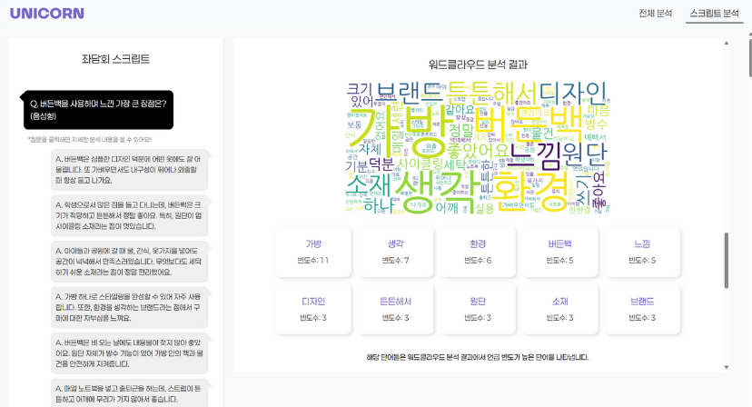

# 🦄 Unicorn 좌담회 AI 분석 서버

스타트업 좌담회 플랫폼 **Unicorn**을 위한 AI 분석 서버입니다. 음성/텍스트 응답을 실시간으로 처리하고, 토픽 분석, 감정 분석, 워드클라우드 생성 등 다양한 AI 기반 인사이트를 제공합니다.



*좌담회 스크립트 분석과 워드클라우드 시각화를 제공하는 Unicorn AI 분석 서버의 사용자 인터페이스*

## 🚀 주요 기능

### 📊 AI 분석 기능
- **토픽 분석**: LDA(Latent Dirichlet Allocation) 기반 토픽 모델링
- **감정 분석**: 응답별 감정 상태 분석 및 통계
- **워드클라우드**: 시각적 키워드 분석
- **임베딩 분석**: TensorBoard를 활용한 응답 유사도 시각화
- **요약 생성**: LLM 기반 좌담회 전체 요약

### 🎤 음성 처리
- **STT(Speech-to-Text)**: OpenAI Whisper 기반 음성 인식
- **실시간 처리**: Base64 인코딩된 음성 데이터 처리
- **다국어 지원**: 한국어 최적화

### 📝 텍스트 처리
- **전처리**: 불용어 제거, 토큰화
- **스크립트 생성**: 질문-답변 구조화
- **데이터 집계**: 회사/회의/질문별 데이터 관리

## 🏗️ 기술 스택

- **Backend**: FastAPI (Python)
- **AI/ML**: 
  - OpenAI GPT (요약 생성)
  - OpenAI Whisper (음성 인식)
  - OpenAI Embeddings (벡터 임베딩)
  - Gensim (토픽 모델링)
  - TensorFlow (임베딩 시각화)
- **시각화**: 
  - WordCloud
  - TensorBoard
  - pyLDAvis
- **클라우드**: AWS S3 (워드클라우드 저장)
- **컨테이너**: Docker

## 📁 프로젝트 구조

```
meeting-analyze-model/
├── AnalyzeMeeting/           # AI 분석 모듈
│   ├── embedding_vector_model.py  # 임베딩 벡터 분석
│   ├── gen_wordcloud.py           # 워드클라우드 생성
│   ├── llm_model.py               # LLM 모델
│   ├── make_script.py             # 스크립트 생성
│   ├── make_summary.py            # 요약 생성
│   ├── sentiment_model.py         # 감정 분석
│   ├── stt.py                     # 음성 인식
│   ├── text_organize.py           # 텍스트 전처리
│   └── topic_model.py             # 토픽 모델링
├── utils/                    # 유틸리티
│   ├── handle_server_data.py      # 서버 데이터 처리
│   └── upload_s3.py               # S3 업로드
├── fonts/                    # 폰트 파일
├── app.py                    # FastAPI 메인 애플리케이션
├── requirements.txt          # Python 의존성
├── Dockerfile               # Docker 설정
└── README.md                # 프로젝트 문서
```

## 🛠️ 설치 및 실행

### 1. 환경 설정

```bash
# 저장소 클론
git clone <repository-url>
cd meeting-analyze-model

# 가상환경 생성 (선택사항)
python -m venv venv
source venv/bin/activate  # Windows: venv\Scripts\activate

# 의존성 설치
pip install -r requirements.txt
```

### 2. 환경변수 설정

`.env` 파일을 생성하고 다음 변수들을 설정하세요:

```env
OPENAI_API_KEY=your_openai_api_key_here
AWS_ACCESS_KEY_ID=your_aws_access_key
AWS_SECRET_ACCESS_KEY=your_aws_secret_key
AWS_REGION=ap-northeast-2
S3_BUCKET_NAME=your_s3_bucket_name
```

### 3. 서버 실행

#### 로컬 실행
```bash
uvicorn app:app --host=0.0.0.0 --port=8000 --reload
```

#### Docker 실행
```bash
# Docker 이미지 빌드
docker build -t unicorn-meeting-analyzer .

# 컨테이너 실행
docker run -p 8000:8000 --env-file .env unicorn-meeting-analyzer
```

## 📚 API 문서

서버 실행 후 다음 URL에서 자동 생성된 API 문서를 확인할 수 있습니다:
- **Swagger UI**: `http://localhost:8000/docs`
- **ReDoc**: `http://localhost:8000/redoc`

## 🔌 API 엔드포인트

### 데이터 제출
- `POST /submit-text` - 텍스트 응답 제출
- `POST /submit-voice` - 음성 응답 제출 (STT 처리)

### 전체 분석
- `POST /meeting-script` - 회의 스크립트 생성
- `POST /meeting-summary` - 회의 요약 생성
- `POST /analyze-all` - 모든 분석 기능 실행

### 개별 분석
- `POST /analyze-topic` - 토픽 분석
- `POST /analyze-embedding` - 임베딩 분석
- `POST /generate-wordcloud` - 워드클라우드 생성
- `POST /analyze-sentiment` - 감정 분석

## 📊 사용 예시

### 1. 텍스트 응답 제출
```python
import requests

response = requests.post("http://localhost:8000/submit-text", json={
    "surveyQuestion": "스타트업에서 가장 중요한 것은 무엇인가요?",
    "textResponse": "고객의 니즈를 정확히 파악하는 것이 가장 중요합니다.",
    "userId": 1,
    "meetingId": 123,
    "corpId": 456,
    "questionId": 789
})
```

### 2. 음성 응답 제출
```python
import base64

# 음성 파일을 Base64로 인코딩
with open("audio.wav", "rb") as audio_file:
    audio_base64 = base64.b64encode(audio_file.read()).decode()

response = requests.post("http://localhost:8000/submit-voice", json={
    "surveyQuestion": "스타트업에서 가장 중요한 것은 무엇인가요?",
    "voiceResponse": audio_base64,
    "userId": 1,
    "meetingId": 123,
    "corpId": 456,
    "questionId": 789
})
```

### 3. 전체 분석 실행
```python
response = requests.post("http://localhost:8000/analyze-all", json={
    "corpId": 456,
    "meetingId": 123
})

result = response.json()
print(f"토픽 분석: {result['topic_result']}")
print(f"워드클라우드: {result['wordcloud_filename']}")
print(f"감정 분석: {result['sentiment_result']}")
```

## 🔧 개발 가이드

### 새로운 분석 모델 추가
1. `AnalyzeMeeting/` 디렉토리에 새로운 모델 파일 생성
2. `app.py`에 해당 엔드포인트 추가
3. 필요한 의존성을 `requirements.txt`에 추가

### 로깅
- 모든 API 호출은 `app.log` 파일에 기록됩니다
- 로그 레벨: INFO, ERROR
- 인코딩: UTF-8

## 🚨 주의사항

1. **API 키 보안**: `.env` 파일을 Git에 커밋하지 마세요
2. **메모리 사용량**: 대용량 음성 파일 처리 시 메모리 사용량을 모니터링하세요
3. **S3 권한**: 워드클라우드 저장을 위한 S3 버킷 권한이 필요합니다
4. **GPU 사용**: CUDA 지원 GPU가 있으면 더 빠른 처리가 가능합니다

## 📞 지원

문제가 발생하거나 질문이 있으시면 이슈를 생성해 주세요.

---

**Unicorn 좌담회 AI 분석 서버**로 스타트업의 인사이트를 한 단계 업그레이드하세요! 🚀
